# Image-Based Lighting
The goal of this project is to learn more about high dynamic range (HDR) imaging, image-based lighting (IBL), and their applications. Specifically, HDR images are created from a sequence of low dynamic range (LDR) images, and 3D models are composited into images using [Blender](https://www.blender.org/) and image-based lighting techniques. This project is based on this [assignment](https://yxw.cs.illinois.edu/course/CS445/Content/projects/ibl/ComputationalPhotography_ProjectIBL.html) in computational photography at UIUC in spring 2023.

## Table of Contents
1. [Recovering HDR Maps](#recovering-hdr-maps)
1. [Panoramic Transformations](#panoramic-transformations)
1. [Rendering Synthetic Objects](#rendering-synthetic-objects)
1. [Outside Example](#outside-example)   
1. [Acknowledgements/Attributions](#acknowledgementsattributions)

## Recovering HDR Maps
One way to re-light an object in a photograph is to use a spherical mirror. A spherical mirror captures light in all directions, which can be used to map the intensity of light at every point in the scene. Converting these LDR light maps to an HDR image will allow a greater range of light intensity, which can vary greatly in magnitude in the real world while an LDR image is constrained to pixel values between 0-255. Creating an HDR image involves merging several images taken at different exposures where exposure is the amount of light that reaches the sensor while the shutter is open. This approach is inspired by [Debevec 1998](https://www.pauldebevec.com/Research/IBL/debevec-siggraph98.pdf).

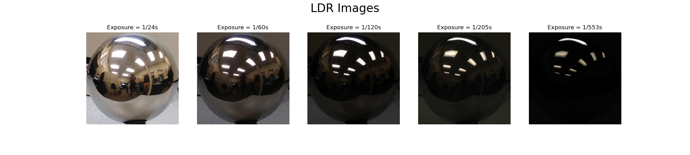

Above are LDR images of the spherical mirror taken at different exposures. 

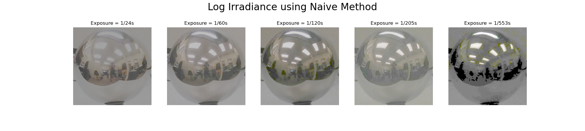

Irradiance is the amount of light received per second by the sensor cell. Since there are multiple images at different exposures, the irradiance should be constant for a given pixel. The naïve approach assumes a direct linear relationship between intensity and total exposure and is calculated as $Irradiance_j=  \frac{LDR_j}{Exposure_j }$, where $j$ is the $j^{th}$ image. The problem with this method, however, is that if any pixel is under- or overexposed, the result will contain clipped values and thus incorrect information.

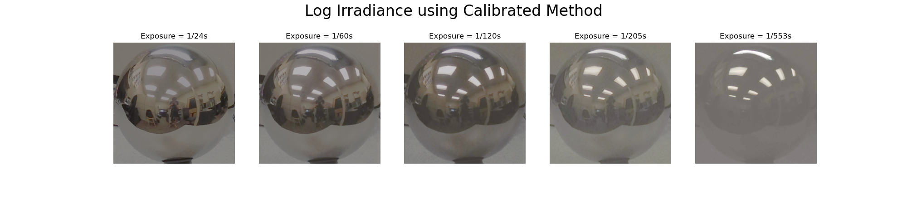

Generally, intensity is a non-linear function of exposure both due to clipping and the camera response function, which for most cameras compresses very dark and bright exposure values into a smaller range of intensity values. To convert pixel values to true irradiance values, this nonlinear response function is estimated. Since there are multiple observations of each pixel with different exposure times, the irradiance (exposure per second) at each pixel can be solved up to an unknown constant factor. 

Following the [Debevec and Malik 1997](https://www.pauldebevec.com/Research/HDR/debevec-siggraph97.pdf), the constraint to solve for is $g(Z_{ij})= \ln{R_i} + \ln⁡{t_j}$, where $i$ is the $i^{th}$ pixel, $j$ is the $j^{th}$ image, $Z$ is the pixel value for an image, $R$ is the irradiance for each pixel, $t$ is the exposure time of each image, and $g$ is the inverse log response function. Solving for log irradiance for each pixel intensity involves solving a linear least squares problem.

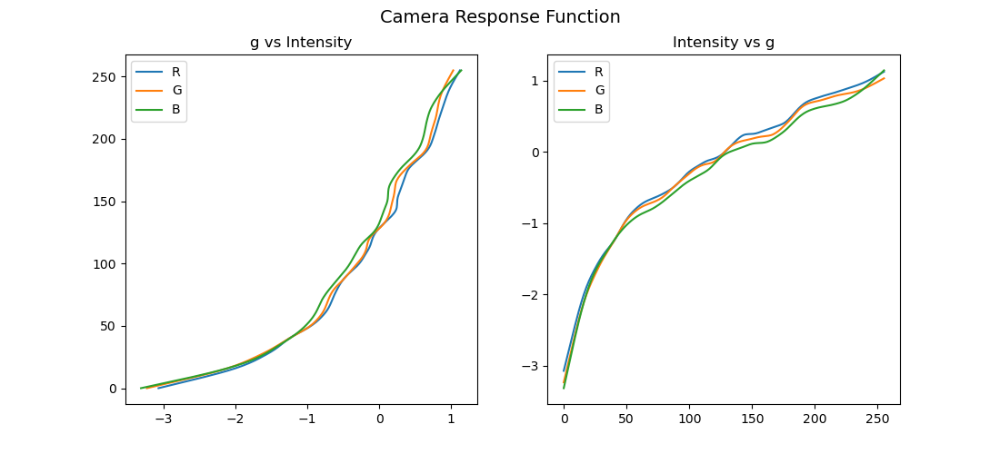

The camera response function is estimated for each channel separately. For pixel values near 0 and 255, the slope of the response function increases. Ultimately, this will lead to a greater dynamic range and more consistent estimates when merging the LDR images into an HDR image. 

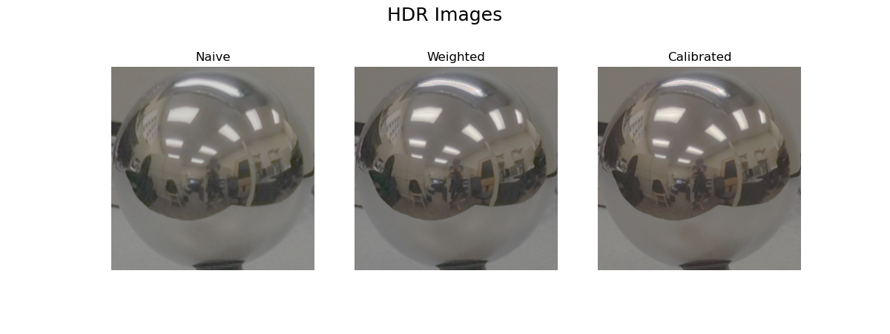

Creating the HDR image involves merging the irradiance images at different exposures by averaging across pixel values. The naïve method uses an unweighted average. 

The weighted HDR image uses a weighted average defined by the following weighting function: $w(z)=128-|z-128|$, where $z$ is a pixel value. This function maps each pixel intensity into weights where values close to 128 have weights close to 1, and pixel intensities near 0 or 255 have weights close to 0. Therefore, under- and over-exposed pixels will have less effect on the final intensity value. 

The calibrated method combines the estimated camera response function and the previous weighting function to merge the images together: $\frac{\sum_{j=1}^{p} w(z_{ij}) (g(z_{ij} - \ln{t_j}))}{\sum_{j=1}^{p} w(z_{ij})}$, where $i$ is the $i^{th}$ pixel, $j$ is the $j^{th}$ image, $z$ is the pixel value for an image, $R$ is the irradiance for each pixel, $t$ is the exposure time of each image, $g$ is the inverse log response function, and $w$ is the weighting function.

 

**Log Range and RMS Errors of HDR Methods:**

|   Method   | Log Range | RMS Error |
|:----------:|:---------:|:---------:|
| Naive      |   6.175   |   0.321   |
| Weighted   |   6.855   |   0.282   |
| Calibrated |   7.153   |   0.250   |

From the table above, we can see that each subsequent method of HDR estimation provides a greater dynamic range and more consistent irradiance estimates per image.

[Back to top](#table-of-contents)
 
 

## Panoramic Transformations
Blender does not accept a spherical light map as an acceptable format, so the spherical coordinates are transformed into equirectangular coordinates. This involves calculating the normal vectors and reflection vectors at each point on the sphere. 

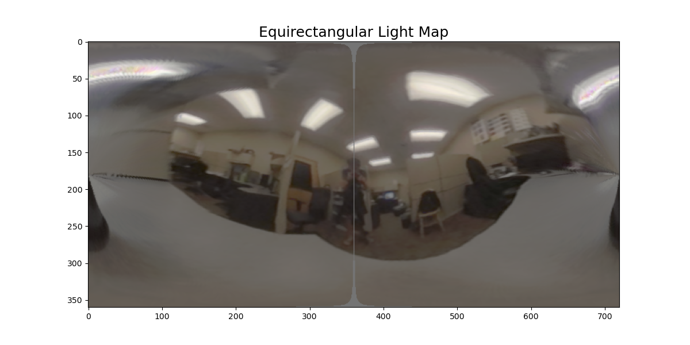

[Back to top](#table-of-contents)
 
 

## Rendering Synthetic Objects
Finally, with the HDR, equirectangular light map of the scene, 3D objects can be realistically rendered into the image using differential rendering. The composite is defined by:

$$composite=M*R+(1-M)*I+(1-M)*(R-E)*c,$$

where $M$ is the object mask, $R$ is the rendered image with objects, $I$ is the background image, $E$ is rendered image without objects. The first two summands insert the objects into the background image, and the last summand adds the light effects, which are modulated by the parameter $c$. 

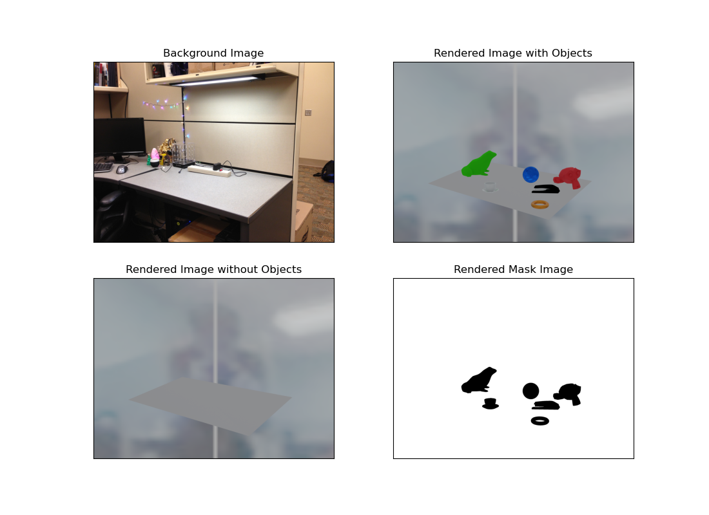
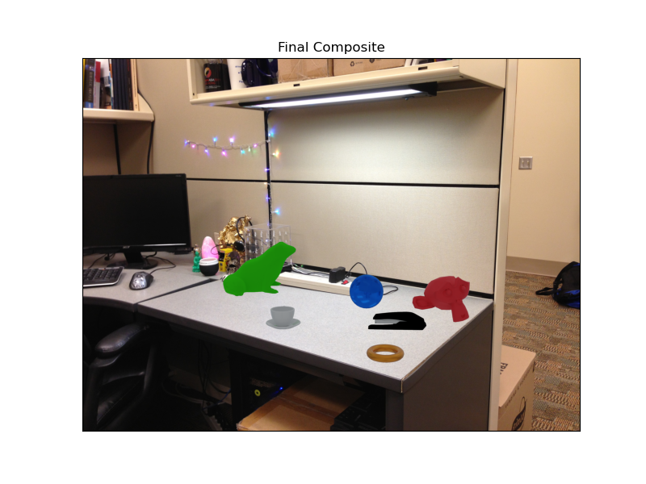

[Back to top](#table-of-contents)
 
 

## Outside Example

### Recovering HDR Maps:
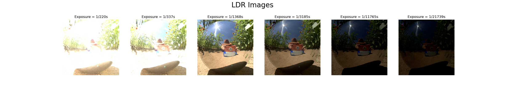

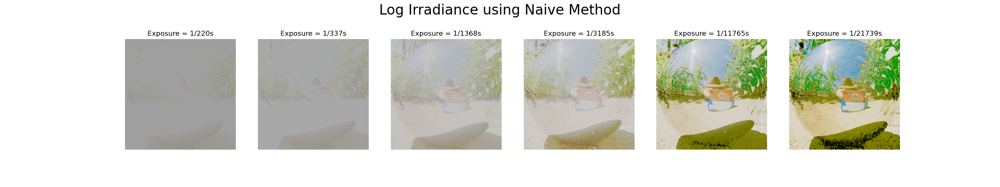

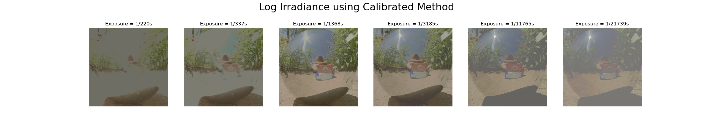

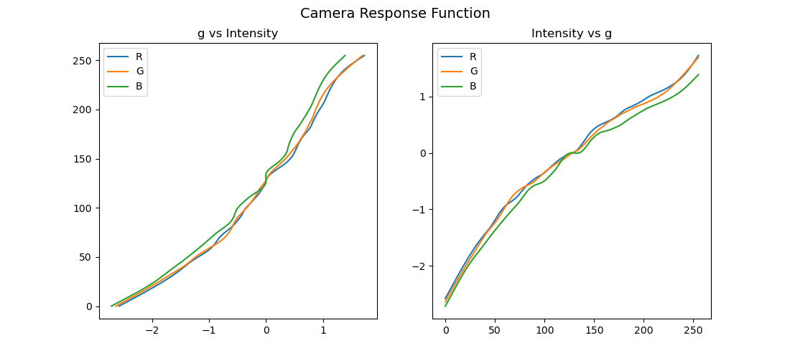

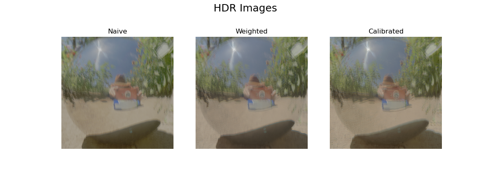

 

**Log Range and RMS Errors of HDR Methods:**

|   Method   | Log Range | RMS Error |
|:----------:|:---------:|:---------:|
| Naive      |   5.660   |   0.553   |
| Weighted   |   5.731   |   0.458   |
| Calibrated |   6.588   |   0.333   |

[Back to top](#table-of-contents)
 
 

### Panoramic Transformations:
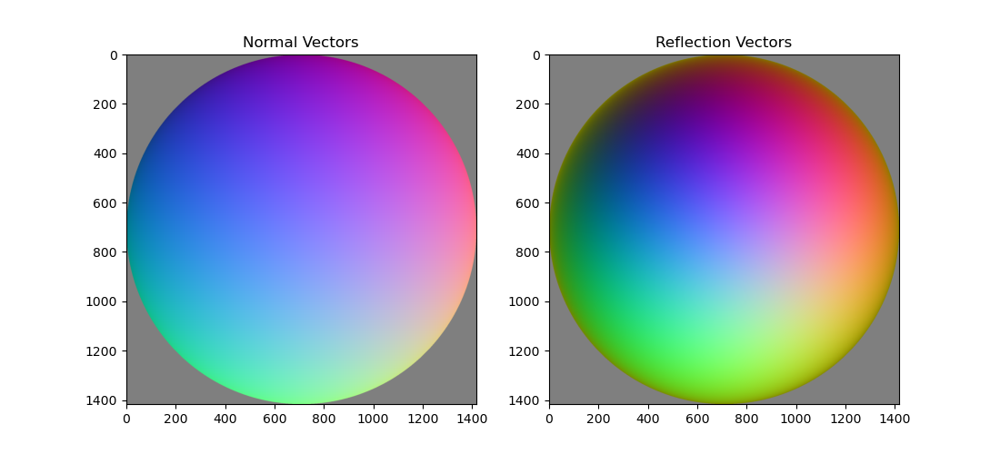

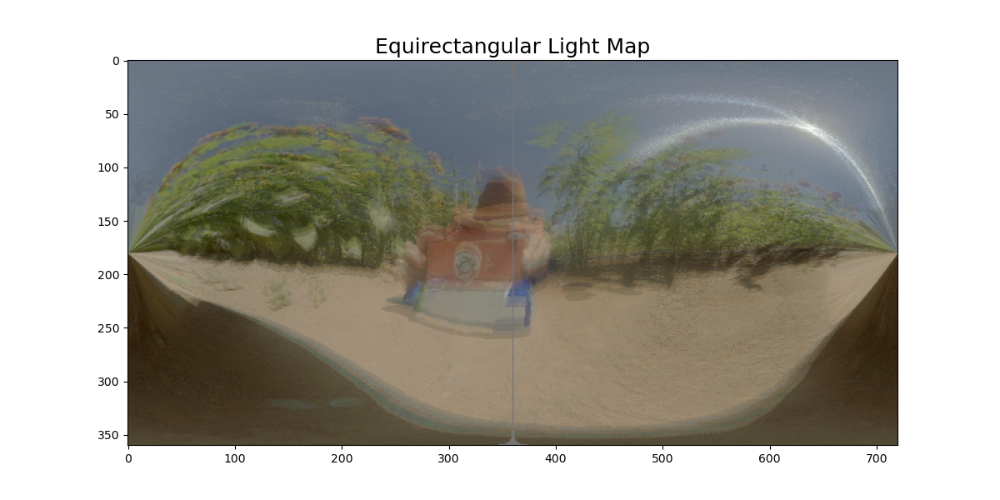

[Back to top](#table-of-contents)
 
 

### Rendering Synthetic Objects:
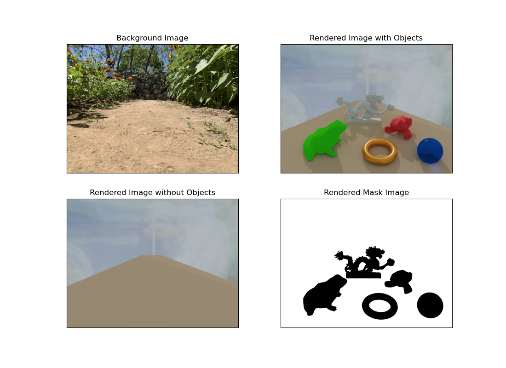

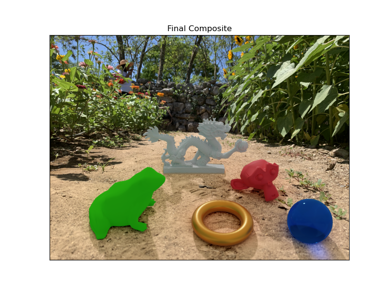

[Back to top](#table-of-contents)
 
 

## Acknowledgements/Attributions:
Non-Blender objects came from [turbosquid.com](https://www.turbosquid.com/3d-models/3d-ceramic-frog-toad-lowpoly-3d-model-1798441)

- [Coffee cup](https://www.turbosquid.com/3d-models/3d-ceramic-coffee-cup-1427808)
- [Dragon](https://www.turbosquid.com/3d-models/scan-dragon-2-obj-free/1036057)
- [Frog](https://www.turbosquid.com/3d-models/3d-ceramic-frog-toad-lowpoly-3d-model-1798441)
- [Stapler](https://www.turbosquid.com/3d-models/3d-stapler-1532365)
